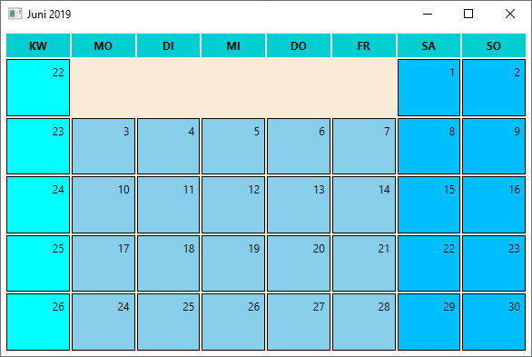

# Kalendar

Es soll eine kleine Kalendarausgabe implementiert werden. Dies kann eine reine Konsolenbasierte Anwendung sein, ist aber auch mit einer kleinen GUI möglich.

https://de.wikipedia.org/wiki/Cal_(Unix)

---

# DotNet Core

```console
lansi@Jupiter:~/InternshipProjectExamples/Calendar/DotNet/Console$ dotnet run
┌───────────────────────────┐
│                 Juni 2019 │
├────┬──────────────────────┤
│ KW │ MO DI MI DO FR SA SO │
├────┬──────────────────────┤
│ 22 │                 1  2 │
│ 23 │  3  4  5  6  7  8  9 │
│ 24 │ 10 11 12 13 14 15 16 │
│ 25 │ 17 18 19 20 21 22 23 │
│ 26 │ 24 25 26 27 28 29 30 │
└────┴──────────────────────┘
```

---

# DotNet WPF

